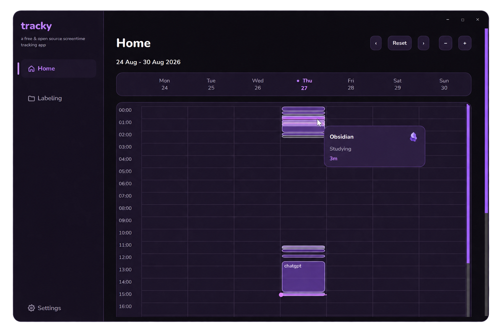
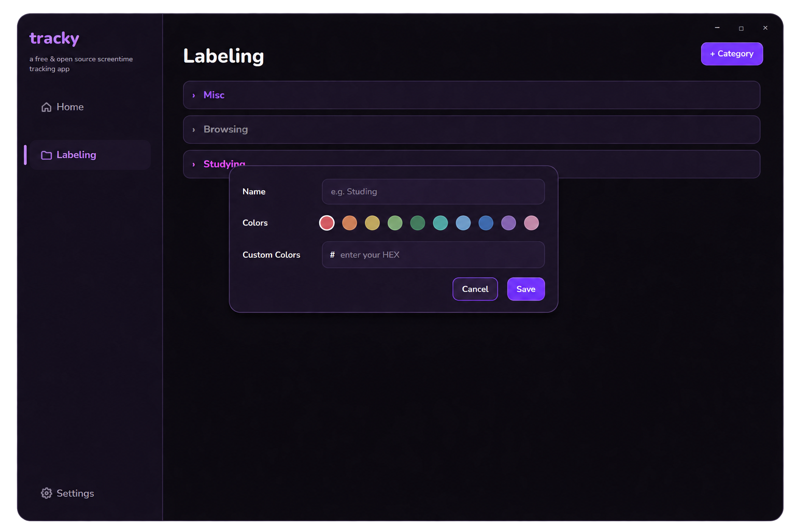
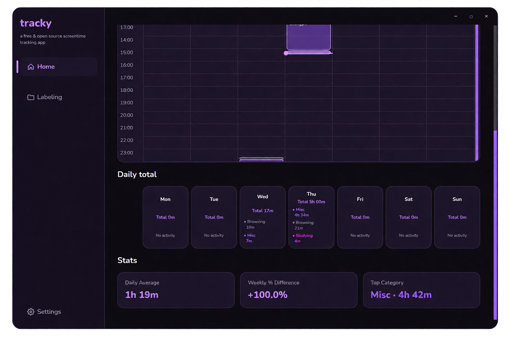

# tracky

A free and open source screen time tracking app for Windows.

Tracky tracks the application you are actively using, organizes your screen time into categories, and displays everything in a simple weekly calendar.

<p align="center">
  
</p>

## Installation

The easiest way to install Tracky is from the **[Stable Release](https://github.com/Jestermax-Haskeller/tracky/releases/tag/Stable)**.

1. Download `TrackySetup.exe`
2. Run the installer
3. Open **tracky** from the Start menu

No Python installation is required.

## Build it yourself

### Requirements

Install Python 3.14, Git, and Inno Setup:

```powershell
winget install -e --id Python.Python.3.14
winget install -e --id Git.Git
winget install -e --id JRSoftware.InnoSetup
```

Clone Tracky:

```powershell
git clone https://github.com/Jestermax-Haskeller/tracky.git
cd tracky
```

Build the installer:

```powershell
.\build_installer.bat
```

Your finished installer will be created at:

```text
installer_dist\TrackySetup.exe
```

<p align="center">
  
</p>

## Project structure

```text
tracky/
├── assets/
│   └── media/
├── tracky/
│   ├── pages/
│   ├── browser.py
│   ├── database.py
│   ├── main_window.py
│   ├── tracker.py
│   ├── styles.py
│   └── widgets.py
├── main.py
├── requirements.txt
├── run_dev.bat
├── build_installer.bat
├── tracky.spec
└── installer.iss
```

## How it works

Tracky only counts the **currently focused application**, rather than every program running in the background.

On Windows it uses:

* **Win32 APIs** to detect the foreground window and user idle time
* **psutil** to identify the application and executable
* **Windows UI Automation** to detect the current website in supported browsers
* **PySide6** for the interface
* **SQLite** for local screen time history and settings

Browser URLs are validated before being stored. Tracky records the domain rather than displaying long URLs.

Very short switches between applications are ignored so the timeline does not become cluttered with tiny sessions.

<p align="center">
  
</p>

## Local database

All screen time data is stored locally in:

```text
%LOCALAPPDATA%\Tracky\tracky.sqlite3
```

SQLite stores:

* Screen time sessions
* Applications and websites
* Labels
* Categories and colors
* Tracky settings

Tracky updates the current session instead of creating a new database entry every second, keeping the database small and simple.

## Privacy

Tracky is designed to work locally and offline.

* No accounts
* No analytics
* No telemetry
* No screen time data is collected by us
* No tracking history is uploaded
* All source code is open source

Your database stays on your computer.

### Verify the installer

Each release can include a SHA-256 checksum.

To check your downloaded installer:

```powershell
Get-FileHash .\TrackySetup.exe -Algorithm SHA256
```

Compare the result with the SHA-256 hash published on the GitHub release.

## License

Tracky is free and open source under the [MIT License](LICENSE.txt).

**[Download Tracky](https://github.com/Jestermax-Haskeller/tracky/releases/tag/Stable)** · **[Source Code](https://github.com/Jestermax-Haskeller/tracky)**
